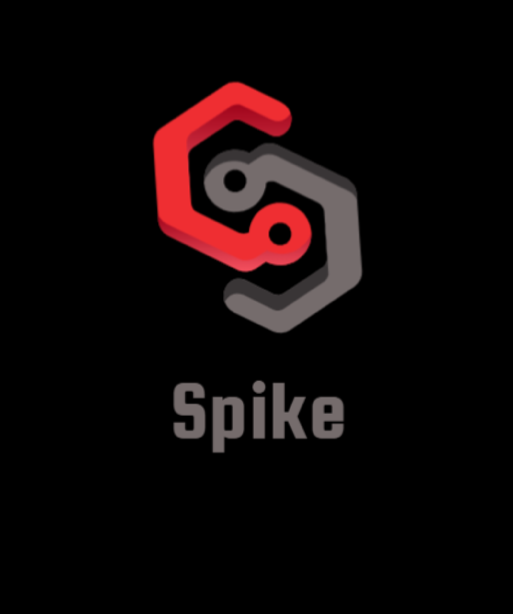
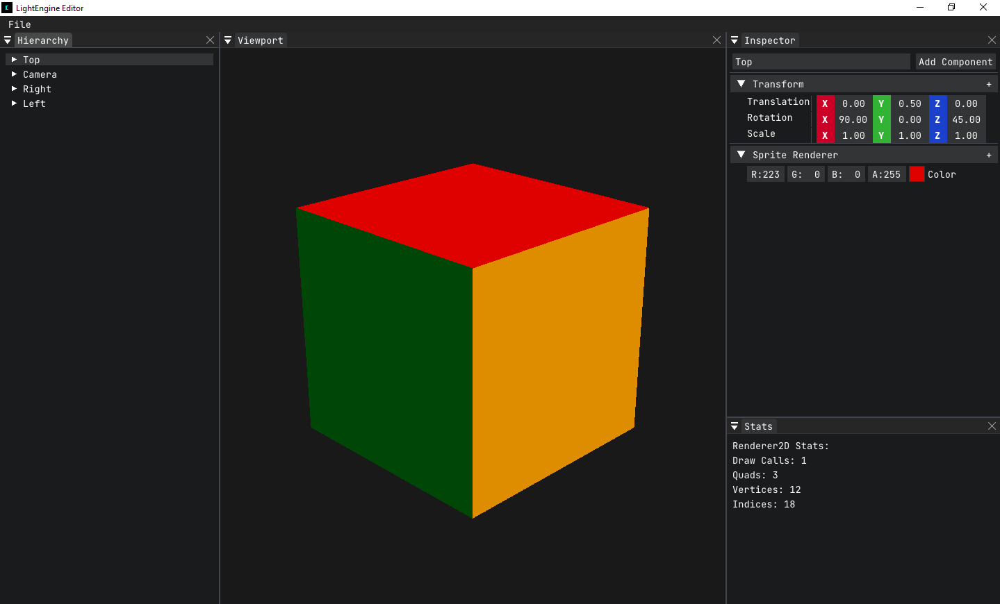

# Spike


[](https://www.codacy.com/gh/FahimFuad/Spike/dashboard?utm_source=github.com&amp;utm_medium=referral&amp;utm_content=FahimFuad/Spike&amp;utm_campaign=Badge_Grade)


## Welcome to the **Spike**'s source code

It is a **Game engine** written in **C++**

# Windows Setup


- Visual Studio 2019 is highly recommended in Windows
- Start by cloning the repository with `git clone --recursive https://github.com/FahimFuad/Spike.git` to clone along with the submodules. If you have already cloned and you want to initialize the submodules, type `git submodule init` and to update the submodules type `git submodule update` in your project directory.

## Premake

- Run the `WindowsGenProjects.bat` file inside the scripts folder and Premake will generate project files for Visual Studio 2019.
- If you want to generate for other IDE or versions of Visual Studio then in the project directory run your favourite premake [action](https://github.com/premake/premake-core/wiki/Using-Premake#using-premake-to-generate-project-files)
- Once premake generate the project files then you can hit the run button and make the engine up and running!

## CMake

- You need to have CMake in your machine! Go [here](https://cmake.org/download/) to download the latest CMake and be sure to add CMake to your environment variable in your OS. We recommend downloading the installer and checking the option `Add to Path`
- With CMake, CLion is the recommended IDE but Visual Studio 2019 will also work fine!

- CLion
  - In CLion you can add this repository as a project. And hit the play button!

- Visual Studio 2019
  - Run the `WindowsGenProjectsCMake.bat` file inside the scripts folder to generate project files for Visual Studio 2019 inside the build folder in the root directory.Open the `Spike.sln` and hit the play button to get the engine running!

- Others

  - If you want to generate for other IDE or versions of Visual Studio then in the project directory then run the following code :arrow_down:

  ```cmake
  # makes a directory named build in the root directory
  mkdir build

  # Enters the build directory
  cd build

  # You CMake action
  cmake <Your-CMake-action>
  ```

  - Once CMake generates the project files then you can hit the run button and make the engine up and running!

# Mac & Linux Setup


## Premake

- Start by cloning the repository with `git clone --recursive https://github.com/FahimFuad/Spike.git` to clone along with the submodules. If you have already cloned and you want to initialize the submodules, type `git submodule init` and to update the submodules type `git submodule update` in your project directory.
- To genereate the project files for your IDE, select the actions of the premake and run them in the project directory. A list of actions of the premake can be found [here](https://github.com/premake/premake-core/wiki/Using-Premake#using-premake-to-generate-project-files)
- The engine is now ready to run!

## CMake

- You need to have CMake in your machine! Go [here](https://cmake.org/download/) to download the latest CMake and be sure to add CMake to your environment variable in your OS. We recommend downloading the installer and checking the option `Add to Path`
- With CMake, CLion is the recommended IDE in Mac & Linux

- CLion
  - In CLion you can add this repository as a project. And hit the play button!

- Others
  - If you want to generate for other IDE then you should make a directory in the project root directory called **`build`** and generate CMake files with other CMake actions

  - Once CMake generates the project files then you can hit the run button and make the engine up and running!

# Screenshot



# Main features to come

- Fast 2D rendering (UI, particles, sprites, etc.)
- High-fidelity Physically-Based 3D rendering
- Support for Mac, Android and iOS
- Native rendering API support (DirectX, Vulkan, Metal)
- Fully featured viewer and editor applications
- Fully scripted(C#) interaction and behavior
- Integrated 3rd party 3D physics engine
- Procedural terrain and world generation
- Robust Artificial Intelligence(AI) system
- Audio system

# Implemented Features

- Console Logging
- Internal Key and Mouse Codes
- Input Polling
- LayerStack and Layers
- Event System and Events
- 2D Renderer
- Fast and easy to use API for 2D Rendering
- Entity Component System(ECS)
- Native C++ Scripting
- GUI Editor (Spike-Editor)
- Deltatime
- Scene system
- Scene Serialization and Deserialization using YAML
- On Screen Gizmos to control the Transform of the object
  - Translation, rotation and scale
- Built in editor console
- Editor Camera
- 2D Physics

# Dependencies

- **[DearImGui](https://github.com/FahimFuad/imgui)** for Graphical User Interface
- **[GLFW](https://github.com/FahimFuad/glfw)** for Windowing
- **[Glad](https://github.com/Dav1dde/glad)** OpenGL loader
- **[ImGuizmo](https://github.com/FahimFuad/ImGuizmo)** for Gizmo's
- **[stb_image](https://github.com/nothings/stb/blob/master/stb_image.h)** for image loading
- **[glm](https://github.com/g-truc/glm)** used as Math Library
- **[EnTT](https://github.com/skypjack/entt)** for Entity component system
- **[spdlog](https://github.com/gabime/spdlog)** for fast Logging
- **[yaml-cpp](https://github.com/FahimFuad/yaml-cpp)** for scene serialization
- **[ASSIMP](https://github.com/FahimFuad/assimp)** for model loading
- **[box2D](https://github.com/FahimFuad/box2d)** for 2D Physics

## Contributing [](https://GitHub.com/FahimFuad/Spike/graphs/contributors/)

- For contributing, fork this repository first.
- Then made a feature branch in your fork and start adding stuff.
- When you're ready with your feature, you can send a Pull Request(PR).
- Then your code will be reviewed and if everything goes well, your commits will be mergerd!

This engine is inspired from **TheCherno's** [Hazel](https://github.com/TheCherno/Hazel) Engine.

[](https://discord.gg/QugaNbUPzb)
