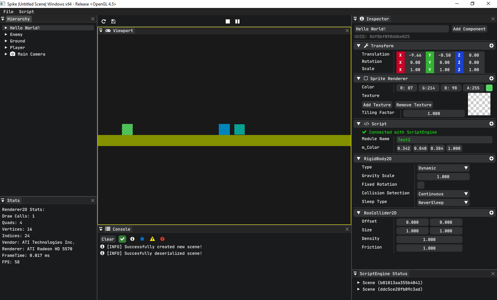

# Spike

## Welcome to the **Spike**'s source code

***A C++17 game engine, which can run on a toaster***  

## Looking how to setup Spike on your system? Its right [here](Resources/docs/Setup.md)!

# Spike in Action

| Features                                     | Status                   |
| :---                                         |        :---:             |
| Console Logging                              | :heavy_check_mark: Done  |
| Internal Key and Mouse Codes                 | :heavy_check_mark: Done  |
| Input Polling                                | :heavy_check_mark: Done  |
| LayerStack and Layers                        | :heavy_check_mark: Done  |
| Event System and Events                      | :heavy_check_mark: Done  |
| 2D Renderer                                  | :heavy_check_mark: Done  |
| Entity Component System(ECS)                 | :heavy_check_mark: Done  |
| C# Scripting                                 | :heavy_check_mark: Done  |
| GUI Editor (Spike-Editor)                    | :heavy_check_mark: Done  |
| Scene Serialization and Deserialization      | :heavy_check_mark: Done  |
| Gizmos to control the Transform of the object| :heavy_check_mark: Done  |
| Built in developer console                   | :heavy_check_mark: Done  |
| Editor Camera                                | :heavy_check_mark: Done  |
| 2D Physics                                   | :heavy_check_mark: Done  |
| 3D model loading with albedo                 | :heavy_check_mark: Done  |
| Playmode and conept of scene runtime         | :heavy_check_mark: Done  |
| **Vault** system for caching assets          | :heavy_check_mark: Done  |
| Super fast mesh loading                      | :heavy_check_mark: Done  |
| And many more (not listed here)              | :heavy_check_mark: Done  |
| Material System                              | :hammer_and_pick: Working|
| Asset Manager                                | :hammer_and_pick: Working|
| DX11 Support                                 | :hammer_and_pick: Working|
| Vulkan Support                               | :hammer_and_pick: Working|
| Robust UI, drag and drop support             | :hammer_and_pick: Working|
| Crossplatform Support                        | :hammer_and_pick: Working|
| Integrated profiler                          | :hammer_and_pick: Working|
| And many more to-do (not listed here)        | :hammer_and_pick: Working|

All the above features which are done are tested in **Release** mode

# Dependencies

- **[DearImGui](https://github.com/FahimFuad/imgui)** for Graphical User Interface
- **[mono](https://www.mono-project.com)** for C# scipting
- **[GLFW](https://github.com/FahimFuad/glfw)** for Windowing
- **[Glad](https://github.com/Dav1dde/glad)** OpenGL loader
- **[ImGuizmo](https://github.com/FahimFuad/ImGuizmo)** for Gizmo's
- **[stb_image](https://github.com/nothings/stb/blob/master/stb_image.h)** for image loading
- **[glm](https://github.com/g-truc/glm)** used as Math Library
- **[EnTT](https://github.com/skypjack/entt)** for Entity component system
- **[yaml-cpp](https://github.com/FahimFuad/yaml-cpp)** for scene serialization
- **[ASSIMP](https://github.com/FahimFuad/assimp)** for model loading
- **[box2D](https://github.com/FahimFuad/box2d)** for 2D Physics

## Contributing

So you want to contribute? AWESOME! Follow the steps below and you will be good to go

- For major changes, open a [Issue](https://guides.github.com/features/issues) first
- Joining our discord server is recommended if you are contributing. As we will respond super fast than the github issues or discussions, plan on the feature etc.. (Link can be found at the end of this README)
- For contributing, [fork](https://docs.github.com/en/github/getting-started-with-github/fork-a-repo) this repository first.
- Then make a feature branch in your fork and start adding stuff.
- When you're ready with your feature, you have tomake a [Pull Request(PR)](https://docs.github.com/en/github/collaborating-with-issues-and-pull-requests/about-pull-requests).
- Then your code will be reviewed and if everything goes well, your commits will be mergerd!

  
Toaster?

By toaster we mean old hardware. Spike can run smoothly even with a hardware from 2011. We have tested this engine on ATI RadeonHD 5570 (a GPU from 2011) with an Intel processor of 2nd generation! So Spike can run on any hardware which is from 2011 and onwards smoothly. Of Course having a better GPU and CPU will give you a perfomance boost!

You can join our [discord server](https://discord.gg/QugaNbUPzb) if you have any questions or if you want to follow the development of SpikeEngine!  

